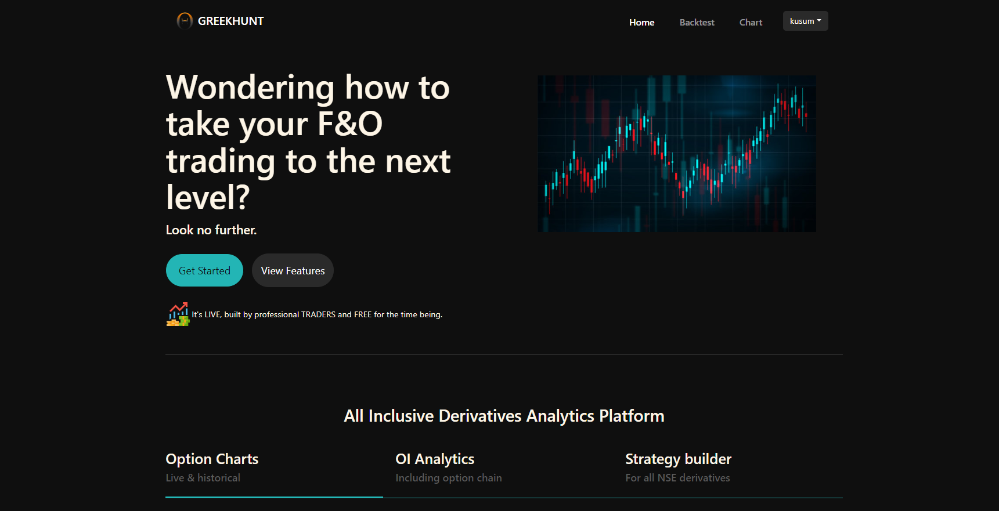
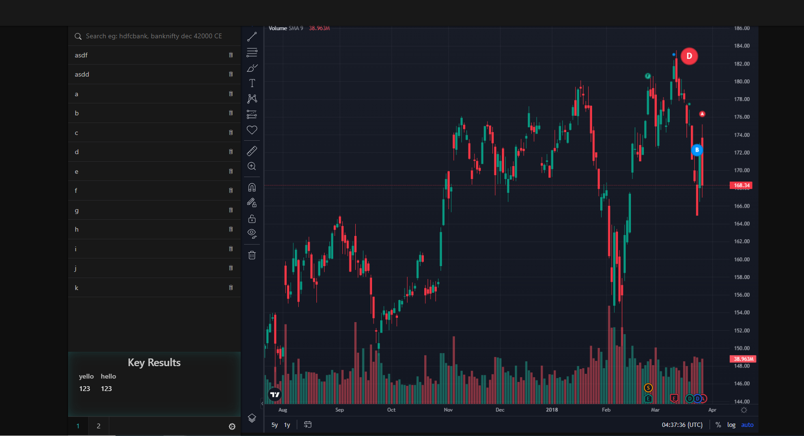
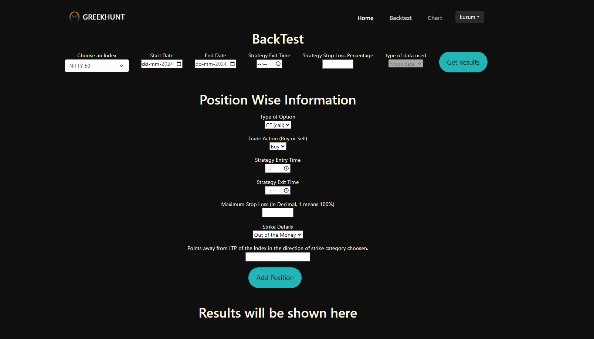

# Option Intraday Backtesting Project

## Overview

This project is designed for backtesting strategies for option intraday trading. It is composed of three main components:

1. **Frontend**: User interface for performing backtests with stock data visualization.
2. **Backend**: Handles authorization, coin system for backtesting, and user data management.
3. **Option-Backtest-Service**: Generates mock option data and performs backtesting using the Black-Scholes algorithm.

## Project Structure

### Frontend

- **Features**:
  - Landing page with a backtest form.
  - Chart using the TradingView API for visualizing stock data.
  - Interactive interface for adding and removing stocks.
- **Port**: 3001

### Backend

- **Features**:
  - Authorization with Passport and custom strategies.
  - Coin system requiring users to have coins for backtesting.
  - MongoDB database for secure user data storage.
- **Port**: 3000

### Option-Backtest-Service

- **Features**:
  - Uses the Black-Scholes algorithm to generate mock option data.
  - Performs backtesting and provides results like total profit, average profit, maximum drawdown, most and least profitable days, and stoploss hits.
- **Port**: 2999

### Integration

- **Authorization**: Handled via token checking to ensure secure communication.
- **Service Communication**: Backend communicates with the option-backtest-service.

### Scalability

- **Multithreading**: Not implemented yet but can be added to improve performance and handle larger data volumes.

## Running the Project

To run the project, execute the `start.js` script located in the root directory. This script installs dependencies and starts all services.

### Prerequisites

1. **Node.js**: Required to run JavaScript files and manage dependencies.
2. **npm**: Node package manager for installing packages.
3. **MongoDB**: Must be installed and running for the backend to function.

### Steps to Run

1. **Ensure MongoDB is Running**: Make sure MongoDB is installed and operational on your machine or you have access to a running instance.

2. **Navigate to the Project Directory**: Open your terminal and navigate to the project's root directory.

3. **Run the Start Script**:

   ```sh
   node start.js

This will:
- Install necessary dependencies for each component.
- Start the frontend on port 3001.
- Start the backend on port 3000.
- Start the option-backtest-service on port 2999.

## Dependencies

- **Node.js**: Required for running the project.
- **npm**: Required for managing dependencies.
- **MongoDB**: Required for user data storage.

Dependencies are managed through `package.json` files in each component and will be installed automatically by the `start.js` script.

## Notes

- Ensure all components are configured correctly and are running on their respective ports.
- Consider implementing multithreading in the future to enhance performance and scalability.

## License

This project is licensed under the MIT License. See the [LICENSE](LICENSE) file for details.

## Contact

For questions or support, please contact at paragg1998@gmail.com.

## Screenshots





